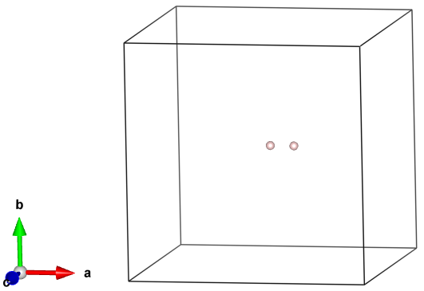

# Atomistic Modeling of Materials

## Getting an account on Aqua
Go to [hpce.iitm.ac.in](https://hpce.iitm.ac.in). Under `HPCE ACCESS` menu, select `create HPCE A/C`. You have to login using your _LDAP credentials_. You can give your faculty advisor name and email id while filling the form. Your request will go to your faculty advisor's workflow and after his/her approval, your account will be created by hcpe team and you will receive login credentials. Typically it will take 1-2 working days.

If you are NOT using institute internet, you need **IITM VPN** to access Aqua. For that you have to send request through faculty advisor to netadmin@iitm.ac.in. Then install [FortiClient VPN](https://www.fortinet.com/support/product-downloads#vpn) software to use VPN. The detailed instructions of setting up VPN are given [here](https://cc.iitm.ac.in/node/30). Typically it will take 1-2 working days to get access.

## SSH
We use secure shell (SSH) to remotely login and run calculations on supercomputers. If you are using linux or mac, open `terminal` and enter the following command
```
ssh rollno@aqua.iitm.ac.in 
```
If you are using windows, install [MobaXterm](https://mobaxterm.mobatek.net/download.html) and then enter the following the following details.<br>
```
Username: rollno
Hostname: aqua.iitm.ac.in
Port    : 22
```

## VESTA
Download [VESTA](https://jp-minerals.org/vesta/en/download.html) software to create and visualize the crystal structure of a material.

Then copy the text in the block below and paste in a file named POSCAR. You can use sublime text or any other text editors. Now, open the file in VESTA and you should be able to see 2 hydrogen atoms seperated by 1 Å in a box of a=b=c=10 Å as shown in the figure below.

file: _POSCAR_
```
New structure
1.0
       10.0000000000         0.0000000000         0.0000000000
        0.0000000000        10.0000000000         0.0000000000
        0.0000000000         0.0000000000        10.0000000000
    H
    2
Direct
     0.500000000         0.500000000         0.500000000
     0.600000000         0.500000000         0.500000000
```


