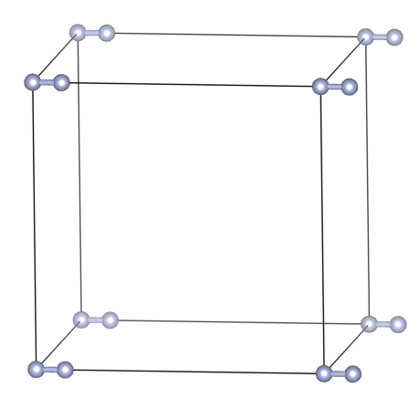

# Calculating Bond Length of N<sub>2</sub> molecule

_File: POSCAR_
```
New structure
1.0
       10.0000000000         0.0000000000         0.0000000000
        0.0000000000        10.0000000000         0.0000000000
        0.0000000000         0.0000000000        10.0000000000
    N
    2
Direct
     0.0000000000         0.000000000         0.000000000
     0.1000000000         0.000000000         0.000000000
```



_File: INCAR_
```
Startparameter for this run:
PREC = Normal
Electronic relaxation
NELM  = 100
EDIFF = 1E-4
Ionic relaxation
EDIFFG = 1E-3
NSW    = 60
IBRION = 2
ISIF   = 2
DOS related values:
ISMEAR = 0
SIGMA  = 0.2
Write flags
LWAVE  = F
LCHARG = F
```

_File: KPOINTS_
```
Auto
0
M
1 1 1
0 0 0
```

_File: job.sh_
```
#!/bin/bash
#PBS -o out
#PBS -e error
#PBS -l walltime=01:59:59
#PBS -l select=1:ncpus=1
tpdir=`echo $PBS_JOBID | cut -f 1 -d .`
tempdir=$HOME/scratch/job$tpdir
mkdir -p $tempdir
cd $tempdir
cp -R $PBS_O_WORKDIR/* .
mpirun -n 1 path_to_vasp_executable > log
mv ../job$tpdir $PBS_O_WORKDIR/.
```

To submit a job
```
qsub job.sh
```

To see the status of job
```
qstat
```
